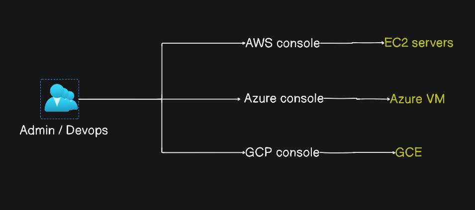
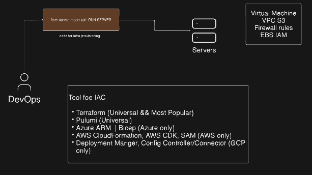
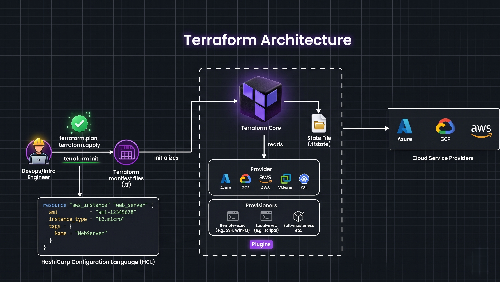
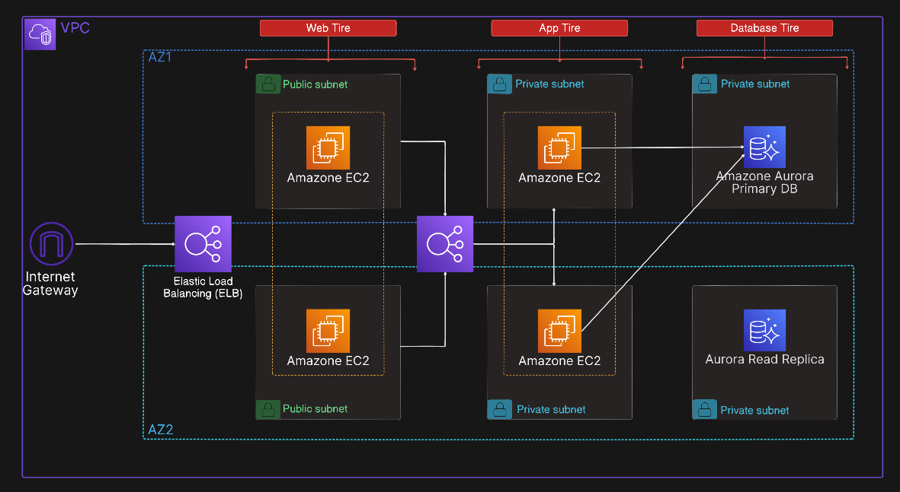
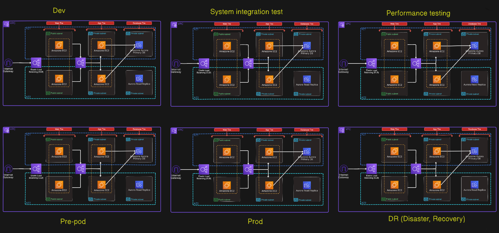
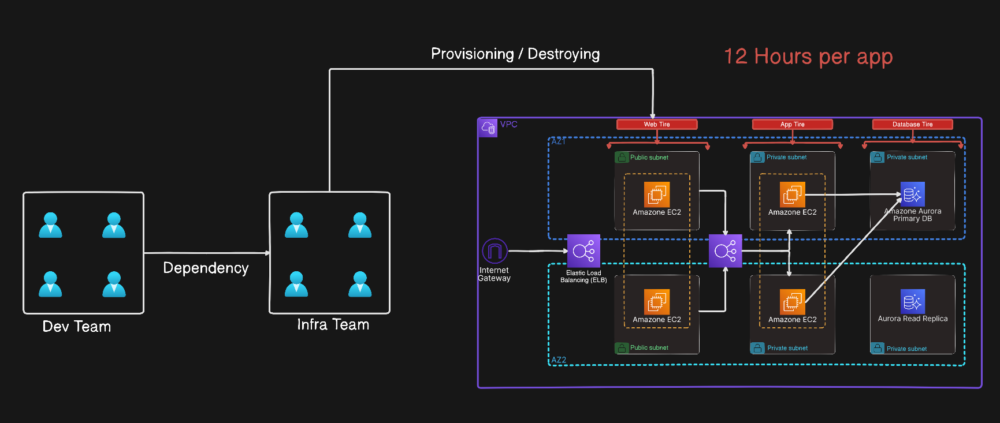
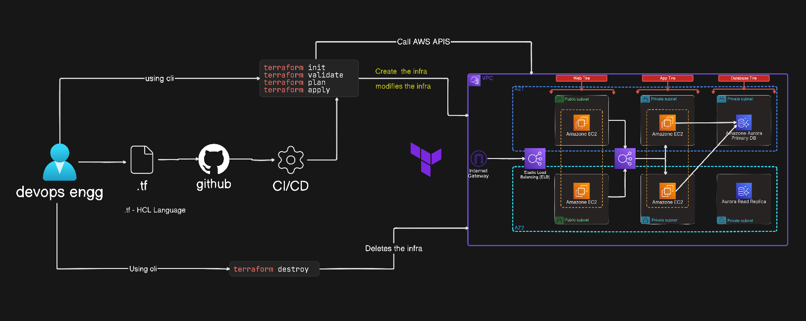

# Introduction to Infrastructure as Code and Terraform

## Topics Covered
- [What is Infrastructure as Code?](#what-is-infrastructure-as-code)
- [Why Infrastructure as Code?](#why-infrastructure-as-code)
- [Benefits of IaC](#benefits-of-iac)
- [What is Terraform?](#what-is-terraform)
- [AWS 3-Tier Architecture](#aws-3-tier-architecture)
- [What Happens at the Enterprise Level?](#what-happens-at-the-enterprise-level)
- [Challenges](#challenges)
- [How Terraform Helps](#how-terraform-helps)
- [How Terraform Works](#how-terraform-works)
- [Install Terraform](#install-terraform)

---

## What is Infrastructure as Code?
Infrastructure as Code (IaC) is the practice of provisioning and managing your infrastructure through code instead of manual processes.



## Why Infrastructure as Code?
- **Consistency**: Deploy identical environments across development, staging, and production.
- **Time Efficiency**: Automated provisioning saves hours of manual work.
- **Cost Management**: Easily track costs and automate cleanup.
- **Scalability**: Deploy to hundreds of servers with the same effort as deploying to one.
- **Version Control**: Track and manage your infrastructure changes in Git.
- **Reduced Human Error**: Eliminate manual configuration mistakes.
- **Collaboration**: Allow teams to collaborate on infrastructure code together.

## Benefits of IaC
- Consistent environment deployment
- Easy to track and manage costs
- Write once, deploy many (single codebase)
- Time-saving automation
- Reduced human error
- Cost optimization through automation
- Version control for infrastructure changes
- Automated cleanup and scheduled destruction
- Developers can focus on application development
- Easy creation of identical environments for troubleshooting

## What is Terraform?
Terraform is a tool for Infrastructure as Code (IaC) that helps automate infrastructure provisioning and management across multiple cloud providers.

In simple terms, instead of manually logging into a cloud provider's website (like AWS, Azure, or Google Cloud) and clicking through dashboards to set up servers, databases, or networks, you write configuration files that describe your desired infrastructure.

Terraform reads your code and handles the heavy lifting of interacting with the cloud provider's API to create, update, or delete those resources for you.

Simpley we can tell that you writ the instructions in .tf file (terraform) it will do the work

eg: you write the code for creating an EC2 instance or S3, and Terraform will create this in the cloud provider like AWS, GCP, etc. You don't need to manually log in and click in AWS, GCP, or any cloud platform.



## Terraform Architucture




## Simple AWS 3-Tier Architecture


A standard 3-tier architecture consists of:
- **Web Tier**: Located in a public subnet, this layer acts as the "front door" for your application and handles incoming user traffic from the internet.
- **App Tier**: Positioned in a private subnet for enhanced security, this tier contains your application logic and is hidden from the public internet.
- **Database Tier**: This is the most secure layer, also in a private subnet, where your data is stored and is only accessible by the App Tier.
- **Availability Zones (AZs)**: The setup is duplicated across two different data centers to ensure high availability; if one fails, the other keeps your application running.
- **Load Balancing**: Acts as a "traffic cop," distributing incoming requests across your servers so no single server becomes overwhelmed.

To build a standard 3-tier architecture (Web, App, Database) on AWS manually from scratch, you should budget for 2 to 4 hours of focused work if you are familiar with the AWS console.

## What Happens at the Enterprise Level?
At the enterprise level, there will be many different environments created for different purposes.

When you create "more environments," you are essentially hosting the project multiple times (or isolated versions of it) in parallel for specific purposes.

Each environment is an independent instance of your application—complete with its own database, compute resources, and networking configurations—which allows you to isolate testing from production.

### Example of Enterprise-level Environments and Their Use Cases


- **Dev**: A sandbox area for developers to build and test features in isolation during the early development phase.
- **System Integration**: A testing ground to ensure that different modules, services, and external APIs work together correctly as a unified system.
- **Performance Testing**: A dedicated environment used to simulate high traffic and load to ensure the system remains stable and responsive under stress.
- **Pre-Prod**: A final dress rehearsal environment that is a near-identical clone of production to perform final validation and end-user testing.
- **Prod**: The live, production-ready environment where end-users access the stable application.
- **DR (Disaster Recovery)**: A standby, failover environment maintained in a separate location to restore operations in the event of a catastrophic failure in the main production site.

Per Environment: Configuring the VPC, subnets, EC2 instances, Load Balancers, and Aurora databases, while ensuring consistent security groups and networking, would take an experienced engineer roughly 4 to 8 hours per environment, assuming a perfect, error-free run.

Total Manual Time: For all 6 environments, this equates to 24 to 48 hours (3 to 6 full working days) of pure configuration time.

At this scale, manual setup becomes highly complicated, and doing all of this manually defeats the purpose of using the cloud.

## Challenges


The development team depends heavily on the infrastructure team because provisioning the environments takes 12 hours per application. Since the development team must wait for this process to complete, it creates a significant bottleneck and dependency.

Other challenges include:
- **Time**: Manual setup of infrastructure takes hours or days, delaying product releases and feedback loops.
- **People**: Requires dedicated specialists to manually configure servers, leading to resource constraints and bottlenecks.
- **Cost**: Unused or forgotten resources remain running, leading to unnecessary cloud expenses.
- **Repetitive tasks**: Recreating the same environment structure repeatedly is tedious and wastes valuable engineering hours.
- **Human errors**: Manual configuration inevitably leads to mistakes, typos, and forgotten security settings.
- **Security risks (insecure environments)**: Inconsistencies in manual setups can accidentally expose resources or leave critical security settings unapplied.
- **"It works on my machine" syndrome**: Differences between local development configurations and the production environment cause bugs that only show up after deployment.

## How Terraform Helps


With Terraform, DevOps engineers write the configuration once, enabling you to create and manage multiple environments using a single configuration file.

Key benefits of using Terraform:
- **Saves time**: Automates provisioning, turning hours of manual UI clicking into seconds of command execution.
- **Consistent environments**: Guarantees that development, staging, and production environments are configured identically.
- **Write once, deploy many**: Reuse the exact same infrastructure codebase to deploy across different regions or environments.
- **Change tracking via version control**: Every modification is documented in Git, showing who made changes, when, and why.
- **Makes life easier**: Eliminates manual troubleshooting and complex setups, letting developers focus on writing actual application code.

## How Terraform Works
Terraform uses `.tf` files written in **HCL** (HashiCorp Configuration Language). It is similar to JSON, but features its own structure that is both human-readable and machine-readable.

The workflow is as follows:
1. A DevOps engineer writes configurations in `.tf` files.
2. The files are tracked using a version control system like Git, and pushed to a repository such as GitHub.
3. Using a CI/CD pipeline or running them manually, you execute the Terraform commands.

`Write Terraform files` ➔ `Run Terraform commands` ➔ `Call AWS APIs through Terraform Provider`

### Terraform Workflow Phases
- `terraform init`: Initialize the working directory.
- `terraform validate`: Validate the configuration files.
- `terraform plan`: Create an execution plan.
- `terraform apply`: Apply the changes to reach the desired state.
- `terraform destroy`: Destroy the infrastructure when needed.

When you create a resource from the AWS Management Console or using the AWS CLI, it interacts with the AWS API. Similarly, when you use Terraform, the exact same thing happens: Terraform interacts with and calls the AWS API.

---

## Install Terraform
Follow the official installation guide: [HashiCorp Terraform Installation Guide](https://developer.hashicorp.com/terraform/install)

### Common Installation Commands

#### For macOS
```bash
brew install hashicorp/tap/terraform
```

#### For Ubuntu/Debian
```bash
wget -O- https://apt.releases.hashicorp.com/gpg | sudo gpg --dearmor -o /usr/share/keyrings/hashicorp-archive-keyring.gpg
echo "deb [signed-by=/usr/share/keyrings/hashicorp-archive-keyring.gpg] https://apt.releases.hashicorp.com $(lsb_release -cs) main" | sudo tee /etc/apt/sources.list.d/hashicorp.list
sudo apt update && sudo apt install terraform
```

### Setup Commands
```bash
terraform -install-autocomplete
alias tf=terraform
terraform -version
```

### Common Installation Error (macOS)
If you encounter the following error:
```text
Error: No developer tools installed.
```
Install the Xcode Command Line Tools:
```bash
xcode-select --install
```