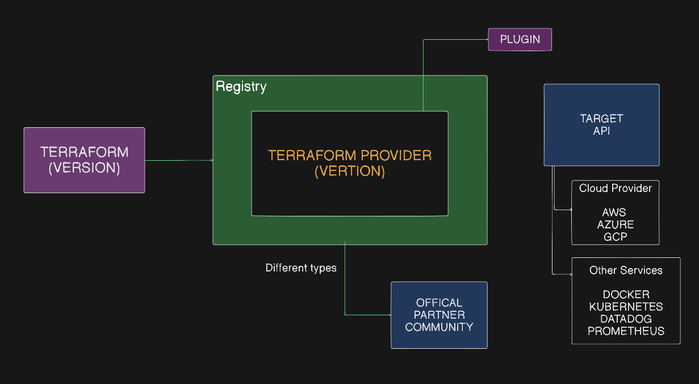

# Terraform Provider

## Topics Covered
- [What is a Terraform Provider?](#what-is-a-terraform-provider)
- [Why Version Matters](#why-version-matters-and-why-cant-we-use-the-latest-terraform-version)
- [Simple Example Code](#simple-example-code)
- [Version Constraints & Operators](#version-constraints)
- [Useful Aliases](#useful-aliases)
- [Practical Lab](#-practical-lab)

---

## What is a Terraform Provider?

It is like a plugin used to translate the Terraform code into code that the cloud provider understands.

**Example:**
When you are provisioning a resource with your cloud provider (such as AWS to create an S3 bucket), you call the AWS S3 API to provision the resource.

You write the Terraform code in a `.tf` file using the HCL (HashiCorp Configuration Language). Since cloud providers like AWS, GCP, etc., do not understand HCL directly, we need a provider plugin to translate HCL into the API requests that the cloud provider understands.

### Different Types of Providers

- **Official**: Maintained officially by HashiCorp (e.g., `aws`, `azure`, `gcp`).
- **Partner**: Maintained by a third-party organization in partnership with HashiCorp.
- **Community**: Maintained by open-source community members.



```terraform
terraform {
  required_providers {
    aws = {
      source  = "hashicorp/aws"
      version = "~> 6.0"
    }
  }
}

# Configure the AWS Provider
provider "aws" {
  region = "us-east-1"
}
```

The AWS provider has its own version, and Terraform core has its own version.

---

### Why version matters and why can't we use the latest Terraform version?

- If you don't specify a version, the latest version will be downloaded and used by default.
- Your configurations might not be compatible with newer or older versions.

Terraform core and Terraform providers have separate version lifecycles:
1. **Terraform core version** is maintained by HashiCorp.
2. **Terraform provider version** (e.g., the AWS provider) is maintained by AWS or the AWS community.

There is a high chance of compatibility issues between the Terraform core version and the provider version if they are not pinned and tested together.

### How do we know which version to lock?
You should lock and use the exact version that you have successfully developed and tested your Terraform configurations against.

### What if the code and versions are outdated?
If you want to upgrade to a newer version, you should first test the upgrade in a non-production environment. Once verified, update and lock the new version before deploying to production.

---

## Simple Example Code

```terraform
terraform {
  // Adding the Terraform version is highly recommended as a best practice. 
  // If you omit 'required_version', Terraform will simply use whatever version is currently installed on the local machine or CI server, which can lead to syntax errors or configuration drifts if team members use different versions.

  required_version = ">= 1.5.0"  // Terraform version

  required_providers {
    aws = {
      source  = "hashicorp/aws"
      version = "~> 6.0" // Terraform provider version
    }
  }
}

# Configure the AWS Provider
provider "aws" {
  region = "us-east-1"
}

# Create a VPC
resource "aws_vpc" "example" {
  cidr_block = "10.0.0.0/16"
}
```

---

## Version Constraints

- `version = "~> 6.7.0"` — This is the **Provider** version constraint.
- `required_version = ">= 1.0"` — This is the **Terraform core** version constraint.

You can see that we use different operators to restrict versions:

- **`=`**: Exact version.
- **`!=`**: Exclude a specific version.
- **`>, >=, <, <=`**: Allow versions matching the comparison.
- **`~>`**: Pessimistic constraint operator (allows only the last specified segment to increment).
  - `~> 1.0.4`: Allows `1.0.5`, `1.0.10`, but NOT `1.1.0`.
  - `~> 1.1`: Allows `1.2`, `1.1.5`, but NOT `2.0`.

### Understanding Version Segments (Semantic Versioning)

Taking `6.7.0` as an example:
- **`6`** is the **Major** version.
- **`7`** is the **Minor** version.
- **`0`** is the **Patch** version.

Using `version = "~> 6.7.0"` allows Terraform to update only the patch version (the last digit).
- It can upgrade to `6.7.1`, `6.7.2`, `6.7.9`, etc.
- It cannot upgrade to `6.8.0`, `6.9.0`, etc. (minor version updates are blocked).

---

## Useful Aliases

These commands help you set an alias so that instead of typing `terraform` every time, you can just type `tf`:

- **On Windows PowerShell:**
  ```powershell
  Set-Alias tf terraform
  ```
- **On Linux / Mac / WSL:**
  ```bash
  alias tf=terraform
  ```

Instead of running `terraform -version`, you can now simply run:
```bash
tf -version
```

---

## Practical Lab

Ready to put this into practice? Head over to the practical lab guide:

 **[Practical Lab: Working with Terraform Providers](./Practical.md)**

*This lab covers setting up a Terraform configuration with the AWS provider, initializing the workspace, validating the syntax, running plans, provisioning a VPC, updating it with tags, and cleaning up resources.*
