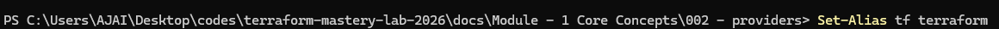
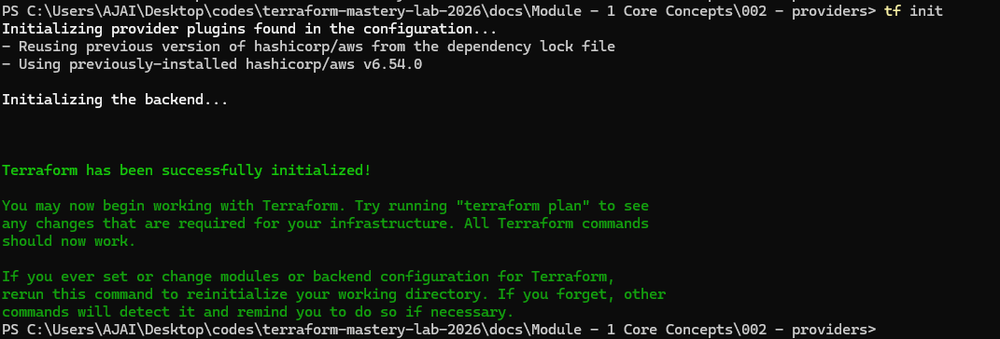
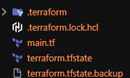
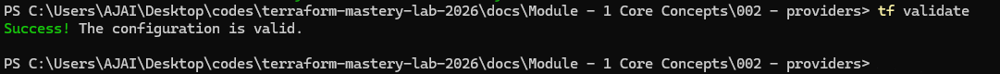
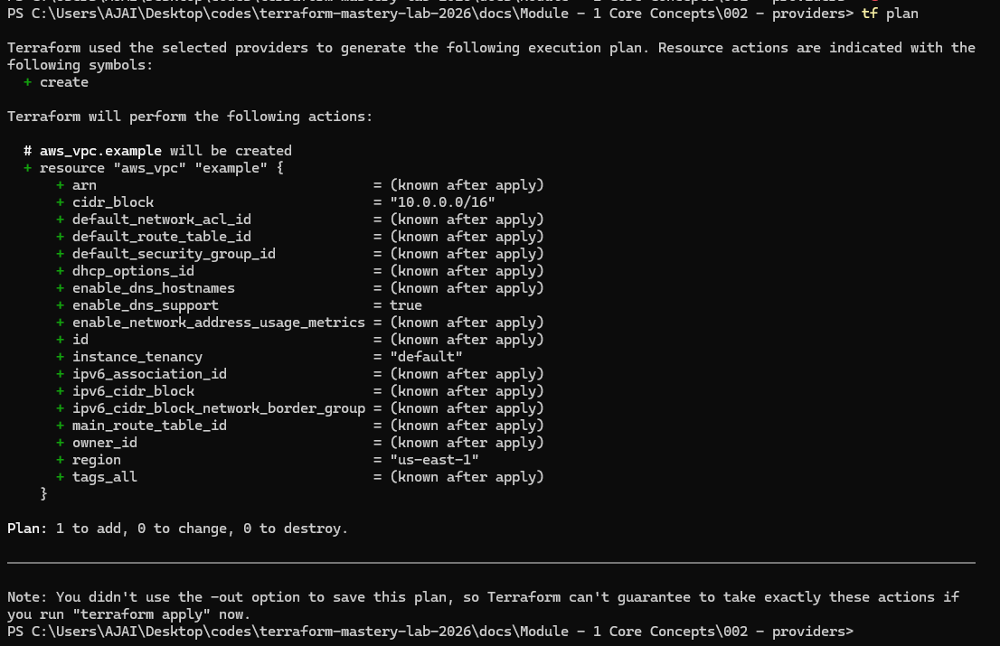
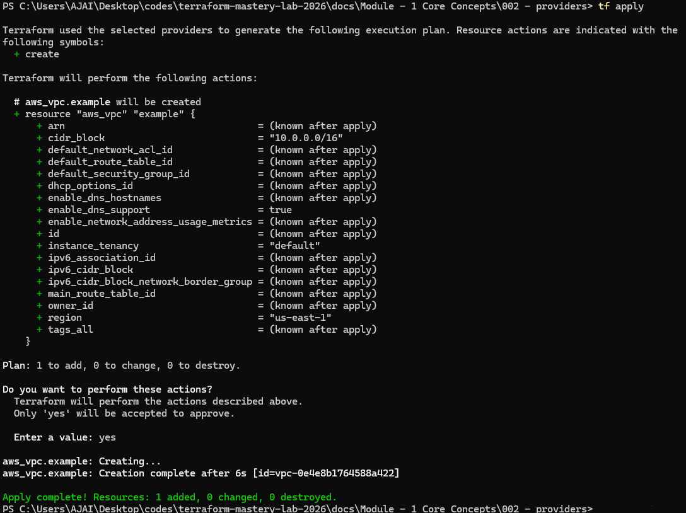
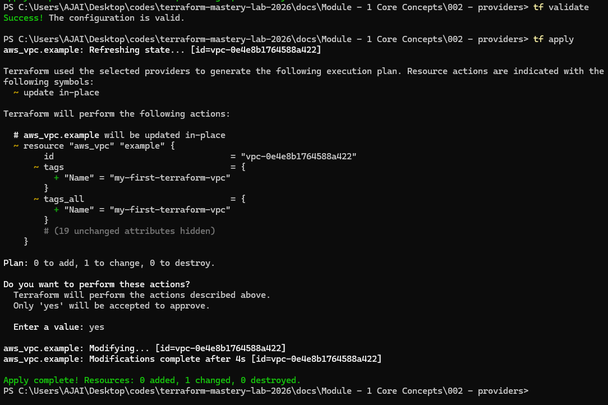
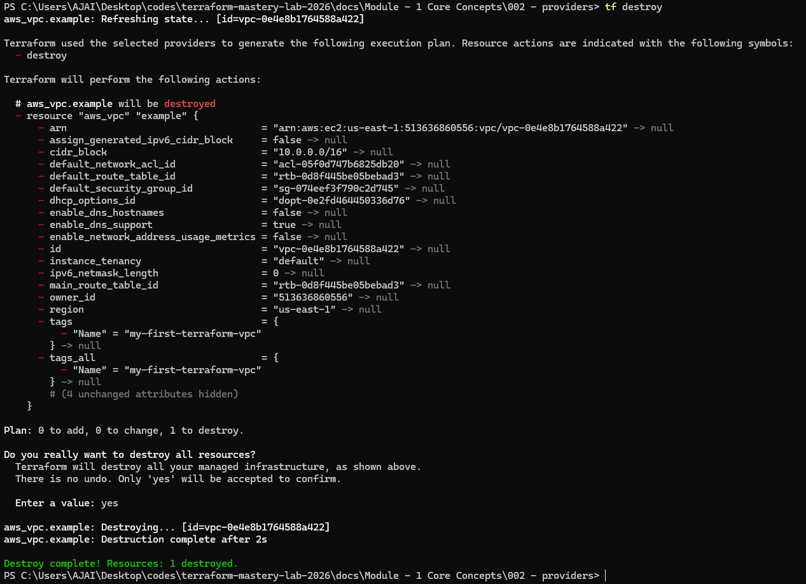

# Terraform Providers - Practical Lab Guide

This step-by-step practical guide demonstrates how to set up, initialize, plan, apply, update, and destroy resources using the AWS Terraform provider.

---

## Step 1: Setting up an Alias for Terraform (Optional)

To speed up execution, you can set a shell alias so that typing `tf` runs `terraform` automatically:



- **On Windows PowerShell:**
  ```powershell
  Set-Alias tf terraform
  ```
- **On Linux / Mac / WSL:**
  ```bash
  alias tf=terraform
  ```

---

## Step 2: Creating the Configuration File

Create a file named `main.tf` and add the following content to configure the AWS provider and provision a VPC:

```terraform
terraform {
  required_providers {
    aws = {
      source  = "hashicorp/aws"
      version = "~> 6.0"
    }
  }
}

# Configure the AWS Provider
provider "aws" {
  region = "us-east-1"
}

# Create a VPC
# Note: Use the 'resource' block when you want to create a new infrastructure component.
resource "aws_vpc" "example" {
  cidr_block = "10.0.0.0/16"
}
```

---

## Step 3: Initializing Terraform

Run the init command to initialize the directory and download the AWS provider plugins:

```bash
tf init
```



### Terraform Folder & File Structure

After running `terraform init` and applying configurations, you will see new directories and files generated in your folder structure:



Here is a breakdown of what each folder and file does:

| Folder / File                  | Description                                                                                                                                          |
| :----------------------------- | :--------------------------------------------------------------------------------------------------------------------------------------------------- |
| **`.terraform/`**              | A directory that contains the cached provider plugins (binaries) and modules downloaded by Terraform.                                                |
| **`.terraform.lock.hcl`**      | The dependency lock file. It locks the exact versions of the provider plugins so that future runs on any machine use the same versions.              |
| **`main.tf`**                  | Your main configuration file written in HCL (HashiCorp Configuration Language) where you define your infrastructure code.                            |
| **`terraform.tfstate`**        | The state file that stores the metadata and mapping of your actual cloud resources to your configuration code. **Do not modify this file manually.** |
| **`terraform.tfstate.backup`** | A backup of the state file created automatically by Terraform before updating the active state.                                                      |

---

## Step 4: Validating the Configuration

Verify that your Terraform configuration is syntactically correct and internally consistent:

```bash
tf validate
```



---

## Step 5: Performing a Dry Run (Plan)

Generate an execution plan to preview the changes Terraform will make to your infrastructure without actually creating them:

```bash
tf plan
```



---

## Step 6: Applying the Changes

Deploy your infrastructure to AWS:

```bash
tf apply
```

Review the plan and type `yes` to confirm the deployment.



---

## Step 7: Updating Resources (Adding Tags)

Let's modify the existing resource in `main.tf` to add a Name tag to our VPC:

```terraform
resource "aws_vpc" "example" {
  cidr_block = "10.0.0.0/16"

  tags = {
    Name = "my-first-terraform-vpc"
  }
}
```

Validate and apply the configuration again to update the resource:

```bash
tf validate
tf apply
```



---

## Step 8: Destroying Infrastructure

Clean up and delete all resources managed by this configuration to avoid unexpected AWS costs:

```bash
tf destroy
```

Type `yes` when prompted to approve the destruction.


