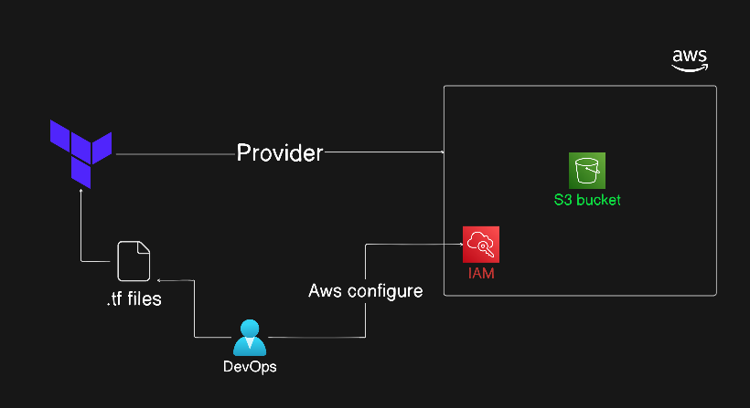

# AWS S3 Bucket Management

## Topics Covered
- [Authentication & Authorization to AWS](#authentication--authorization-to-aws)
- [S3 Bucket Management](#s3-bucket-management)
- [Understanding Dependencies](#understanding-dependencies)
- [Simple Example Code](#simple-example-code)
- [Hands-on Lab](#hands-on-lab)

---

## Authentication & Authorization to AWS

Before Terraform can create any resource on AWS, it needs authentication credentials. Terraform automatically searches for credentials in the following order:

1. **Environment Variables**:
   - `AWS_ACCESS_KEY_ID`
   - `AWS_SECRET_ACCESS_KEY`
2. **AWS Shared Credentials File**:
   - Located at `~/.aws/credentials` (generated when you run `aws configure` via the AWS CLI).
3. **IAM Roles/Profiles**:
   - Assigned to the machine running Terraform (such as EC2 Instance Profiles or GitHub Actions runners).

> [!IMPORTANT]
> Never hardcode AWS Access Keys directly inside your `.tf` files as this is a high-risk security hazard that can leak credentials to GitHub.

---

## S3 Bucket Management

Amazon Simple Storage Service (S3) is an object storage service. When managing S3 buckets with Terraform:

### 1. Global Uniqueness
S3 bucket names must be **globally unique** across all AWS accounts and regions. If you choose a name that is already taken by another user, AWS will throw an error.

### 2. Local Name vs. AWS Bucket Name
Let's analyze the resource block:
```terraform
resource "aws_s3_bucket" "first_bucket" {
  bucket = "my-tf-test-bucket-99901"
}
```
- **`aws_s3_bucket`**: The resource type (tells Terraform what kind of AWS resource to create).
- **`"first_bucket"`**: The **local name** (identifier used internally within Terraform configuration files). You cannot reuse the same local name for the same resource type within the same module.
- **`bucket = "my-tf-test-bucket-99901"`**: The actual **AWS bucket name** that will be created in your AWS account. This is the one that must be globally unique.



---

## Understanding Dependencies

Terraform automatically builds a dependency graph of your infrastructure to decide the order in which to create, modify, or destroy resources.

- **Implicit Dependencies**: Created automatically when one resource refers to another resource's attribute (e.g., using `aws_instance.web.id` inside an Elastic IP resource). Terraform knows it must create the instance before the IP.
- **Explicit Dependencies**: Defined using the `depends_on` meta-argument. Use this when a resource has a hidden dependency on another resource that is not directly referenced in the arguments (e.g., a resource needs an IAM role to exist first, but the API doesn't link them explicitly).

---

## Simple Example Code

This is the configuration defined in your [main.tf](./lab/main.tf) file:

```terraform
terraform {
  required_providers {
    aws = {
      source  = "hashicorp/aws"
      version = "~> 6.0"
    }
  }
}

# Configure the AWS Provider
provider "aws" {
  region = "us-east-1"
}

# Create S3 bucket
resource "aws_s3_bucket" "first_bucket" {
  bucket = "my-tf-test-bucket-99901" // bucket name must be unique

  tags = {
    Name        = "My bucket"
    Environment = "Dev"
  }
}
```

---

## Hands-on Lab

Follow these steps to initialize and deploy the bucket:

1. **Navigate to the [Lab Directory](./lab/) containing the [main.tf](./lab/main.tf) configuration file**:
   ```bash
   cd "docs/Module - 1 Core Concepts/003 - S3 Bucket/lab"
   ```
2. **Initialize Workspace**:
   ```bash
   terraform init
   ```
3. **Validate Configuration**:
   ```bash
   terraform validate
   ```
4. **Plan Changes**:
   ```bash
   terraform plan
   ```
5. **Deploy S3 Bucket**:
   ```bash
   terraform apply
   ```
   Type `yes` when prompted.
6. **Verify**: Log into the AWS Console, navigate to the S3 service, and verify that the bucket `my-tf-test-bucket-99901` exists with the `Name` and `Environment` tags.
7. **Clean up**:
   ```bash
   terraform destroy
   ```
   Type `yes` to delete the bucket and avoid charges.
