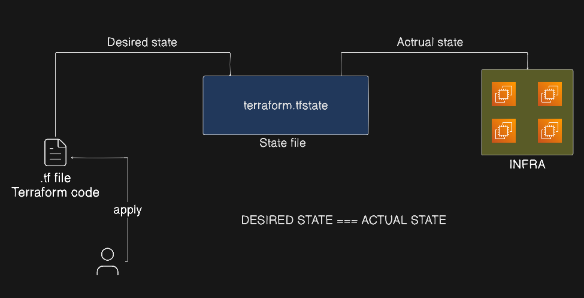
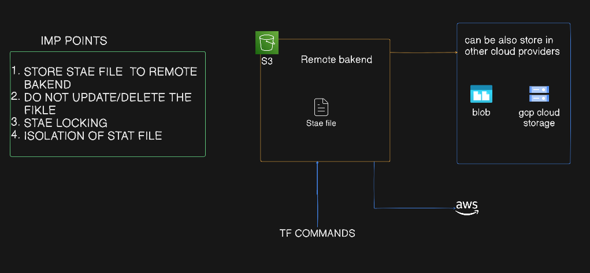

# State File Management - Remote Backend

## Topics Covered
- [How Terraform Updates Infrastructure](#how-terraform-updates-infra)
- [Terraform State File](#terraform-state-file)
- [State File Best Practices](#state-file-best-practices)
- [Remote Backend Setup](#remote-backend-setup)
- [State Management Commands](#state-management-commands)

---

## How Terraform Updates Infra

Terraform updates its infrastructure with the help of the `terraform.tfstate` file.

When a developer runs `terraform apply`, Terraform compares the **Desired State** (your code) and the **Actual State** (the real-world resources). All of this information is stored in the `terraform.tfstate` file.



---

## Terraform State File

A Terraform state file is a highly confidential file that maps your real-world resources to your configuration, keeps track of metadata, and improves performance. It contains detailed information about all resources managed by your configuration.



### Key Concepts:

- **Store State File in a Remote Backend**: The `terraform.tfstate` file contains highly confidential data and must never be stored on local machines or committed to Git. To keep our infrastructure secure and collaborate safely, we store state remotely using an encrypted AWS S3 backend.
- **Do Not Update or Delete the State File Manually**: Modifying the JSON state file directly can corrupt your state and break your infrastructure.
- **State Locking**: To prevent multiple users from modifying the same infrastructure at the same time and corrupting the state, we use State Locking (typically using AWS S3 + DynamoDB or S3 native lockfile).
- **Isolation of State File**: Separate your state files per environment (e.g., use separate state files for development, staging, and production).
- **Regular Backups**: Enable versioning on your remote storage to maintain a history of state files for recovery.

---

## State File Best Practices

Here is a comparison of how state files are managed in different setups (defined in [main.tf](./lab/main.tf)):

### Local State (Old Way):
- **How it works**: Running `terraform apply` makes Terraform look for `terraform.tfstate` in your local project folder on your computer.
- **Why it's bad**: Secret keys are stored in plain text locally, you can accidentally delete or lose the file, and teammates cannot collaborate without overwriting each other's work.

### S3 Remote State (New Way):
- **How it works**: Running `terraform apply` makes Terraform connect to AWS S3 using the credentials and location defined in your `backend "s3"` block. It downloads the latest state file into memory, compares it against your live infrastructure and your `.tf` code, makes the necessary changes, and updates the state directly in the S3 bucket.
- **Why it's best practice**: Centralized state, encrypted at rest, easy team collaboration, and no risk of losing your state file if your local machine crashes!

---

## Remote Backend Setup

> [!IMPORTANT]
> Create the S3 backend bucket separately first. Do not add this bucket to the main resource blocks of the same Terraform configuration (to avoid a chicken-and-egg deployment issue).

Define the backend configuration inside your `terraform {}` block:

```terraform
terraform {
  backend "s3" {
    bucket       = "my-first-terraform-backend-bucket" // Unique bucket name
    key          = "dev/terraform.tfstate"            // Path within the bucket to store the state file
    region       = "us-east-1"
    encrypt      = true
    use_lockfile = true                               // Enable S3 native state locking
  }
}
```

After adding this block, run the initialization command:
```bash
terraform init
```

You should see a message confirming the backend setup:
```text
Initializing the backend...

Successfully configured the backend "s3"! Terraform will automatically
use this backend unless the backend configuration changes.
```

### Key Parameters:
- **`bucket`**: The S3 bucket name where the state file is stored.
- **`key`**: The path within the bucket where the state file will be saved.
- **`region`**: The AWS region for the S3 bucket.
- **`use_lockfile`**: Enables S3 native state locking (set to `true`).
- **`encrypt`**: Enables server-side encryption for the state file.

> [!NOTE]
> S3 bucket versioning must be enabled for S3 native state locking and history backups to work properly.

---

### How to Test State Locking

To verify that S3 native state locking is working:

1. **Terminal 1**: Run `terraform apply` (do not type yes immediately; keep the prompt open).
2. **Terminal 2**: While Terminal 1 is still running, try to run `terraform plan` or `terraform apply`.
3. **Expected Result**: The second command should fail with an error:
   ```text
   Error: Error acquiring the state lock
   Error message: operation error S3: PutObject, https response error StatusCode: 412
   Lock Info:
     ID:        <lock-id>
     Path:      <bucket>/<key>
     Operation: OperationTypeApply
     Who:       <user>@<hostname>
   ```
4. **Check S3 Bucket**: During the active operation, you will see a `.tflock` file temporarily created in your S3 bucket.
5. **After Completion**: The lock file will be automatically deleted once the operation finishes.

---

### Backend Migration

If you are moving from local state to a remote backend:

1. **Initialize with new backend configuration**:
   ```bash
   terraform init
   ```
2. **Migrate State**: Terraform will detect the change and prompt you to migrate the existing local state to the S3 bucket. Answer `yes` to copy the state.
3. **Verify**: Check that your state is now stored remotely:
   ```bash
   terraform state list
   ```

---

## State Management Commands

Use these commands to view, inspect, and modify resources within your state safely:

- **List resources in state**:
  ```bash
  terraform state list
  ```
- **Show detailed state information for a resource**:
  ```bash
  terraform state show <resource_name>
  ```
- **Remove a resource from state** (stops tracking the resource without destroying it in AWS):
  ```bash
  terraform state rm <resource_name>
  ```
- **Move a resource to a different state address**:
  ```bash
  terraform state mv <source> <destination>
  ```
- **Pull and display current state file directly in the terminal**:
  ```bash
  terraform state pull
  ```