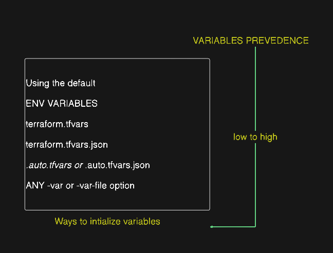

# Terraform Variables

## Topics Covered
- [Why We Need Variables](#why-we-need-variables)
- [Variable Types](#variable-types)
  - [Input Variables](#input-variables)
  - [Output Variables](#output-variables)
  - [Local Values (Locals)](#local-values-locals)
- [Example Configuration](#example-configuration)
- [Variable Precedence](#variable-precedence)
- [Variable Files (.tfvars)](#variable-files)

---

## Why We Need Variables

Whenever you need to use a value again and again, you would normally have to type that value again and again. To solve this issue, we use variables. This allows us to define a value once and reuse it across our configurations.


---

## Variable Types

### Input Variables
Instead of hardcoding values directly into your resource blocks (like writing `"us-east-1"` or `"dev"` over and over), you store those values in an input variable. This makes your code reusable, flexible, and easy to change without touching the actual resource code.
* *Analogy*: Like function parameters in programming.

### Output Variables
Output variables display important information after Terraform finishes creating your infrastructure (such as a public IP address or a VPC ID).
* *Analogy*: Like function return values.

### Local Values (Locals)
Locals are internal computed values that help simplify your code. They are declared once and can be referenced multiple times, but they cannot be configured externally by the user.
* *Analogy*: Like local variables inside a function body.

---

## Example Configuration

This configuration shows how input variables, locals, and outputs are defined and referenced in your [main.tf](./lab/main.tf) file:

```terraform
# Input Variable
variable "Environment" {
  description = "The deployment environment (e.g., dev, stage, prod) to avoid hardcoding names across resources."
  default     = "dev"
  type        = string
}

# Local Values
locals {
  bucket_name = "my-app-storage-${var.Environment}-999101"
  vpc_name    = "${var.Environment}-vpc"
}

# Resource Blocks referencing Variables and Locals
resource "aws_vpc" "main" {
  cidr_block = "10.0.0.0/16"

  tags = {
    Name        = local.vpc_name
    Environment = var.Environment
  }
}

# Output Variable
output "vpc_id" {
  value = aws_vpc.main.id
}
```

To see the value of your outputs after deploying, run:
```bash
terraform output
```

---

## Variable Precedence

When the same variable is assigned multiple values, Terraform resolves the conflict using a specific hierarchy. The precedence order (from **lowest to highest**) is:



1. **Default Value**: Defined in the variable block itself (e.g., `default = "dev"`).
2. **Environment Variables**: Set in your shell using the format `TF_VAR_variable_name` (e.g., `export TF_VAR_Environment=stage`). When run, Terraform will prioritize this value over the default value.
3. **`terraform.tfvars` File**: A file automatically loaded by Terraform to set variable values.
4. **`terraform.tfvars.json` File**: JSON equivalent of the standard tfvars file.
5. **`*.auto.tfvars` or `*.auto.tfvars.json` Files**: Auto-loaded files processed in alphabetical order.
6. **Command-Line Flags (`-var` or `-var-file`)**: Explicitly passed during execution (e.g., `terraform apply -var="Environment=prod"`). This always takes absolute precedence.

---

## Variable Files

You can use variable assignment files (ending in `.tfvars` or `.tfvars.json`) to define values for your variables. 

For example, in your [`terraform.tfvars`](./lab/terraform.tfvars) file, you override the default environment value:
```terraform
Environment = "preprod"
```

When you run `terraform apply`, Terraform automatically loads this file and uses `"preprod"` instead of the default `"dev"`.
