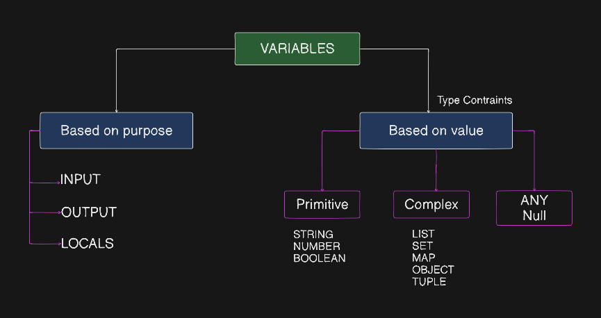

# Type Constraints in Terraform

## Topics Covered
- [Primitive Types (String, Number, Bool)](#primitive-types-string-number-bool)
- [Collection Types (List, Set, Map)](#collection-types-list-set-map)
- [Structural Types (Tuple, Object)](#structural-types-tuple-object)
- [Type Validation & Custom Constraints](#type-validation--custom-constraints)
- [Hands-on Lab Guide](#hands-on-lab-guide)

---



---

## Primitive Types (String, Number, Bool)

Primitive types represent single, basic values.

### 1. `string`
* **What it is**: A sequence of text characters. Used for names, regions, IDs, or descriptions.
* **Example Declaration**:
  ```terraform
  variable "aws_region" {
    description = "The AWS region where resources will be provisioned."
    type        = string
    default     = "us-east-1"
  }
  ```
* **How to use in resource**:
  ```terraform
  provider "aws" {
    region = var.aws_region
  }
  ```

---

### 2. `number`
* **What it is**: A numeric value (can be an integer like `1`, `20` or a float like `3.14`). Used for counts, sizes, or ports.
* **Example Declaration**:
  ```terraform
  variable "bucket_count" {
    description = "Count of S3 buckets to create."
    type        = number
    default     = 1
  }
  ```
* **How to use in resource**:
  ```terraform
  resource "aws_s3_bucket" "app_bucket" {
    count  = var.bucket_count
    bucket = "${local.bucket_name}-${count.index}"
  }
  ```

---

### 3. `bool`
* **What it is**: A boolean value that can only be `true` or `false`. Used as toggle switches for features.
* **Example Declaration**:
  ```terraform
  variable "enable_public_ip" {
    description = "Whether to assign a public IP address."
    type        = bool
    default     = true
  }
  ```
* **How to use in resource**:
  ```terraform
  resource "aws_instance" "example" {
    associate_public_ip_address = var.enable_public_ip
  }
  ```

---

## Collection Types (List, Set, Map)

Collection types hold multiple values of the **same data type**.

### 1. `list(<TYPE>)`
* **What it is**: An ordered collection of elements of the same type.
* **Key Features**: Elements are accessed by index starting at `0` (`var.list[0]`). Allows duplicate values and preserves order.
* **Example Declaration**:
  ```terraform
  variable "vpc_cidr" {
    description = "List of CIDR blocks."
    type        = list(string)
    default     = ["10.0.0.0/16", "172.16.0.0/16", "192.168.0.0/16"]
  }
  ```
* **How to use in resource**:
  ```terraform
  resource "aws_vpc" "main" {
    cidr_block = var.vpc_cidr[0] # Selects "10.0.0.0/16"
  }
  ```

---

### 2. `set(<TYPE>)`
* **What it is**: An unordered collection of unique elements of the same type.
* **Key Features**: Automatically removes duplicate values. Does not support direct index lookup unless converted using `tolist()`.
* **Example Declaration**:
  ```terraform
  variable "vpc_cidr_by_set" {
    description = "Unique set of CIDR blocks."
    type        = set(string)
    default     = ["10.0.0.0/16", "172.16.0.0/16", "192.168.0.0/16"]
  }
  ```
* **How to use in resource**:
  ```terraform
  resource "aws_vpc" "main" {
    cidr_block = tolist(var.vpc_cidr_by_set)[0]
  }
  ```

---

### 3. `map(<TYPE>)`
* **What it is**: A group of key/value pairs where keys are strings and all values share the same type.
* **Key Features**: Excellent for mapping environments (`dev`, `stage`, `prod`) to specific settings. Access values using dot notation (`var.map.key`) or index notation (`var.map["key"]`).
* **Example Declaration**:
  ```terraform
  variable "vpc_cidr_by_env" {
    description = "CIDR block mapped by environment name."
    type        = map(string)
    default     = {
      dev   = "10.0.0.0/16"
      stage = "10.1.0.0/16"
      prod  = "10.2.0.0/16"
    }
  }
  ```
* **How to use in resource**:
  ```terraform
  resource "aws_vpc" "main" {
    cidr_block = var.vpc_cidr_by_env["dev"] # Or var.vpc_cidr_by_env.dev
  }
  ```

---

## Structural Types (Tuple, Object)

Structural types allow grouping multiple values of **different data types** into a single variable.

### 1. `tuple([...])`
* **What it is**: A fixed-length ordered list where each position can have a different type.
* **Key Features**: Access values by index (`var.tuple[0]`). The number and type of elements must match the declaration exactly.
* **Example Declaration**:
  ```terraform
  variable "ec2_config" {
    description = "Tuple containing: [ami_id, instance_type, disk_size_gb, enable_public_ip]"
    type        = tuple([string, string, number, bool])
    default     = ["ami-0c7217cdde317cfec", "t3.micro", 20, true]
  }
  ```
* **How to use in resource**:
  ```terraform
  resource "aws_instance" "example" {
    ami                         = var.ec2_config[0] # string
    instance_type               = var.ec2_config[1] # string
    associate_public_ip_address = var.ec2_config[3] # bool

    root_block_device {
      volume_size = var.ec2_config[2]               # number
    }
  }
  ```

---

### 2. `object({...})`
* **What it is**: A named complex data structure containing multiple attributes, each with its own specified type constraint.
* **Key Features**: Highly readable. Access values by attribute name (`var.object.attribute`). Preferred over tuples for complex configurations.
* **Example Declaration**:
  ```terraform
  variable "ec2_config_object" {
    description = "Object containing EC2 instance configurations."
    type = object({
      ami_id           = string
      instance_type    = string
      disk_size_gb     = number
      enable_public_ip = bool
    })
    default = {
      ami_id           = "ami-0c7217cdde317cfec"
      instance_type    = "t3.micro"
      disk_size_gb     = 20
      enable_public_ip = true
    }
  }
  ```
* **How to use in resource**:
  ```terraform
  resource "aws_instance" "example" {
    ami                         = var.ec2_config_object.ami_id
    instance_type               = var.ec2_config_object.instance_type
    associate_public_ip_address = var.ec2_config_object.enable_public_ip

    root_block_device {
      volume_size = var.ec2_config_object.disk_size_gb
    }
  }
  ```

---

## Type Validation & Custom Constraints

You can add custom `validation` rules to input variables to enforce strict inputs before running Terraform operations:

```terraform
variable "Environment" {
  type    = string
  default = "dev"

  validation {
    condition     = contains(["dev", "stage", "prod"], var.Environment)
    error_message = "Environment must be one of: dev, stage, or prod."
  }
}
```

---

## Hands-on Lab Guide

All code examples demonstrated in this guide are located in the [lab directory](./lab/):

- [`variables.tf`](./lab/variables.tf) — Declarations for all primitive, collection, and structural types.
- [`main.tf`](./lab/main.tf) — Resource blocks demonstrating how to access lists, maps, tuples, and objects.
- [`terraform.tfvars`](./lab/terraform.tfvars) — Environment variable assignment file.

### Commands to Run:
```bash
# Navigate to lab folder
cd "docs/Module - 1 Core Concepts/007 - Type Constraints in Terraform/lab"

# Initialize workspace
terraform init

# Validate configuration and type constraints
terraform validate

# Preview execution plan
terraform plan
```