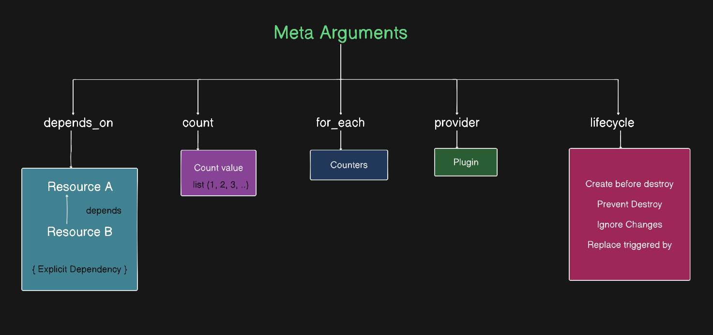

# Terraform Meta-Arguments

## Topics Covered
- [What are Arguments?](#what-are-arguments)
- [Resource Arguments vs. Meta-Arguments](#resource-arguments-vs-meta-arguments)
- [The `depends_on` Meta-Argument](#the-depends_on-meta-argument)
  - [Implicit Dependencies](#implicit-dependencies)
  - [Explicit Dependencies](#explicit-dependencies)
- [The `count` Meta-Argument](#the-count-meta-argument)
- [The `for_each` Meta-Argument](#the-for_each-meta-argument)
- [The `provider` & `lifecycle` Meta-Arguments](#the-provider--lifecycle-meta-arguments)
- [Practical Execution Analysis](#practical-execution-analysis)

---

## What are Arguments?

In Terraform, **arguments** are the inputs you provide inside a resource block to define how that resource should be configured when Terraform creates or manages it.

```terraform
resource "aws_instance" "example" {
  # These are ARGUMENTS (values you pass in):
  ami           = "ami-0c7217cdde317cfec"
  instance_type = "t3.micro"
}
```

---

## Resource Arguments vs. Meta-Arguments

### Resource Arguments (Provided by the Provider)
These arguments are defined by a specific cloud provider (e.g., AWS, Azure, GCP). They represent the actual configuration attributes of that infrastructure resource (such as `ami`, `instance_type`, or `bucket`).

### Meta-Arguments (Provided by Terraform Core)
Meta-arguments are provided directly by **Terraform Core** itself. They work across **any** resource type to change how resources behave, scale, or depend on each other—making infrastructure management flexible and powerful.



The 5 main meta-arguments in Terraform:
1. **`depends_on`**: Specifies explicit dependencies.
2. **`count`**: Creates multiple instances of a resource based on a number.
3. **`for_each`**: Creates multiple instances of a resource based on a set or map.
4. **`provider`**: Specifies a non-default provider configuration.
5. **`lifecycle`**: Controls custom resource creation and destruction behavior.

---

## The `depends_on` Meta-Argument

The `depends_on` meta-argument establishes explicit dependencies between multiple resources.

> **Why is this needed?**
> If you have multiple `.tf` files in a directory, Terraform loads them alphabetically. However, file names do not dictate execution order — Terraform builds a **dependency graph** to decide which resource to provision first.

There are **2 types of dependencies**:

### 1. Implicit Dependency
An implicit dependency happens automatically when **Resource B** references an attribute of **Resource A** (such as `aws_vpc.vpc_a.id`). Terraform automatically detects this relationship and waits to provision Resource B until Resource A is created—without needing `depends_on`.

```terraform
# Resource A (Created First)
resource "aws_vpc" "vpc_a" {
  cidr_block = "10.0.0.0/16"
}

# Resource B (Created Second)
resource "aws_subnet" "subnet_b" {
  # IMPLICIT DEPENDENCY: subnet_b references vpc_a.id
  vpc_id     = aws_vpc.vpc_a.id
  cidr_block = "10.0.1.0/24"
}
```

### 2. Explicit Dependency
An explicit dependency uses the `depends_on` meta-argument to explicitly tell Terraform that Resource B depends on Resource A, even if Resource B does not directly reference any attributes of Resource A in its code.

```terraform
# Resource A
resource "aws_s3_bucket" "example_a" {
  bucket = "my-app-storage-bucket"
}

# Resource B (Explicitly depends on Resource A)
resource "aws_instance" "example_b" {
  ami           = "ami-0c7217cdde317cfec"
  instance_type = "t3.micro"

  # Explicit Dependency: B waits for A to finish creating first
  depends_on = [aws_s3_bucket.example_a]
}
```

---

## The `count` Meta-Argument

`count` is a meta-argument that acts as a loop counter to create multiple copies of a resource without duplicating code.

- It exposes `count.index` (`0`, `1`, `2`...) which can be used to index into a `list` variable.

```terraform
variable "bucket_names_list" {
  description = "List of S3 bucket names to create"
  type        = list(string)
  default     = ["my-app-storage-9991011", "my-app-storage-9992022"]
}

resource "aws_s3_bucket" "bucket_list" {
  count = 2

  bucket = var.bucket_names_list[count.index]

  tags = {
    Environment = var.Environment
    ManagedBy   = "Terraform"
  }
}
```

> **Note on `count` vs `for_each`**:
> `count` works best with indexed `list(string)` types. However, if an item is removed from the middle of a list, `count` re-indexes all subsequent resources, causing Terraform to recreate them. To avoid this, use `for_each` with `set` or `map`.

---

## The `for_each` Meta-Argument

`for_each` iterates over a **`set`** or a **`map`** of values, creating a separate resource instance for each item.

- Inside the block, you access the current item using:
  - `each.key`: The map key or set item.
  - `each.value`: The map value or set item.

### 1. Using `for_each` with a `set(string)`
In a `set`, elements are unique and have no positional keys, so `each.key` and `each.value` are identical.

```terraform
variable "bucket_names_set" {
  type    = set(string)
  default = ["my-app-storage-99910111", "my-app-storage-99920222"]
}

resource "aws_s3_bucket" "bucket_set" {
  for_each = var.bucket_names_set

  bucket = each.value

  tags = {
    Environment = var.Environment
    ManagedBy   = "Terraform"
  }
}
```

### 2. Using `for_each` with a `map(string)`
In a `map`, `each.key` is the map key name, and `each.value` is the map value.

```terraform
variable "bucket_names_map" {
  type = map(string)
  default = {
    "bucket_1" = "my-app-storage-999101111"
    "bucket_2" = "my-app-storage-999202222"
  }
}

resource "aws_s3_bucket" "bucket_map" {
  for_each = var.bucket_names_map

  bucket = each.value

  tags = {
    LogicalName = each.key  
    ManagedBy   = "Terraform"
  }
}
```

### Quick Comparison of Collection Types in `for_each` / `count`:
- **`list(string)`**: `["hello", "world"]` — Accessed by numeric index: `list[0]`, `list[1]`. Used with `count`.
- **`set(string)`**: `["hello", "world"]` — Unordered unique values. Used with `for_each` (`each.value`).
- **`map(string)`**: `{ key = "value" }` — Key/value pairs. Used with `for_each` (`each.key` and `each.value`).

---

## The `provider` & `lifecycle` Meta-Arguments

### `provider`
Specifies an alternate provider configuration when working with multi-region or multi-account setups. (See [`002 - Providers`](../002%20-%20Providers/002-Providers.md) for full details).

### `lifecycle`
Controls lifecycle rules for resource management:
- `create_before_destroy = true`: Creates a new resource before destroying the old one.
- `prevent_destroy = true`: Protects critical resources from accidental deletion.
- `ignore_changes = [tags]`: Ignores external modifications to specific attributes.

---

## Practical Execution Analysis

This section analyzes the execution logs from our [`lab`](./lab/main.tf) setup.

### Scenario 1: Without Dependencies (Parallel Creation)
When resources have no dependencies between them, Terraform provisions them simultaneously in parallel:

```text
aws_s3_bucket.bucket_set["my-app-storage-99920222"]: Creating...
aws_s3_bucket.bucket_set["my-app-storage-99910111"]: Creating...
aws_s3_bucket.bucket_map["bucket_1"]: Creating...
aws_s3_bucket.bucket_list[0]: Creating...
aws_s3_bucket.bucket_map["bucket_2"]: Creating...
aws_s3_bucket.bucket_list[1]: Creating...

aws_s3_bucket.bucket_set["my-app-storage-99910111"]: Creation complete after 16s [id=my-app-storage-99910111]
aws_s3_bucket.bucket_list[0]: Creation complete after 16s [id=my-app-storage-9991011]
aws_s3_bucket.bucket_list[1]: Creation complete after 16s [id=my-app-storage-9992022]
aws_s3_bucket.bucket_set["my-app-storage-99920222"]: Creation complete after 16s [id=my-app-storage-99920222]
aws_s3_bucket.bucket_map["bucket_1"]: Creation complete after 17s [id=my-app-storage-999101111]
aws_s3_bucket.bucket_map["bucket_2"]: Creation complete after 17s [id=my-app-storage-999202222]
```

---

### Scenario 2: With Explicit Dependencies (`depends_on`)
In our lab configuration, we configured explicit dependencies:
- `bucket_map` depends on `bucket_list` (`depends_on = [aws_s3_bucket.bucket_list]`)
- `bucket_set` depends on `bucket_map` (`depends_on = [aws_s3_bucket.bucket_map]`)

**Observed Execution Flow in Logs**:

```text
# Step 1: bucket_list starts creating first
aws_s3_bucket.bucket_list[1]: Creating...
aws_s3_bucket.bucket_list[0]: Creating...
aws_s3_bucket.bucket_list[1]: Creation complete after 7s [id=my-app-storage-9992022]
aws_s3_bucket.bucket_list[0]: Creation complete after 7s [id=my-app-storage-9991011]

# Step 2: Only after bucket_list completes, bucket_map starts creating
aws_s3_bucket.bucket_map["bucket_1"]: Creating...
aws_s3_bucket.bucket_map["bucket_2"]: Creating...
aws_s3_bucket.bucket_map["bucket_1"]: Creation complete after 8s [id=my-app-storage-999101111]
aws_s3_bucket.bucket_map["bucket_2"]: Creation complete after 9s [id=my-app-storage-999202222]

# Step 3: Only after bucket_map completes, bucket_set starts creating
aws_s3_bucket.bucket_set["my-app-storage-99920222"]: Creating...
aws_s3_bucket.bucket_set["my-app-storage-99910111"]: Creating...
aws_s3_bucket.bucket_set["my-app-storage-99920222"]: Creation complete after 8s [id=my-app-storage-99920222]
aws_s3_bucket.bucket_set["my-app-storage-99910111"]: Creation complete after 8s [id=my-app-storage-99910111]
```

**Conclusion**:
By using `depends_on`, Terraform strictly enforces sequential creation:
`bucket_list` ➔ `bucket_map` ➔ `bucket_set`.