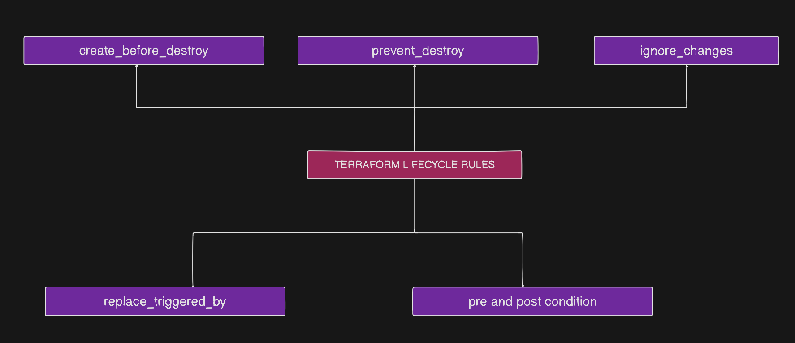

# Terraform Lifecycle Meta-Arguments

## Topics Covered
- [What is a Lifecycle Meta-Argument?](#what-is-a-lifecycle-meta-argument)
- [Terraform Lifecycle Rules](#terraform-lifecycle-rules)
  - [1. create_before_destroy](#1-create_before_destroy)
  - [2. prevent_destroy](#2-prevent_destroy)
  - [3. ignore_changes](#3-ignore_changes)
  - [4. replace_triggered_by](#4-replace_triggered_by)
  - [5. precondition](#5-precondition)
  - [6. postcondition](#6-postcondition)
- [Common Patterns](#common-patterns)
- [Best Practices & Pitfalls](#best-practices--pitfalls)

---

## What is a Lifecycle Meta-Argument?

A lifecycle meta-argument is a nested block inside a resource that defines how Terraform should manage that specific resource's lifecycle operations — creation, update, replacement, and destruction — independently of dependency order.

**Example**: When rebuilding a house, keep the old house until the new one is ready.

---

## Terraform Lifecycle Rules



### 1. `create_before_destroy`

* **What it does**: Forces Terraform to create a replacement resource BEFORE destroying the original resource.
* **Default Behavior**: Normally, Terraform destroys the old resource first, then creates the new one.
* **Use Cases**:
  - EC2 instances behind load balancers (zero downtime)
  - RDS instances with read replicas
  - Critical infrastructure that cannot have gaps
  - Resources referenced by other infrastructure

* **Example**:
  ```terraform
  resource "aws_instance" "example" {
    ami                         = var.ec2_config.ami
    instance_type               = var.ec2_config.instance_type
    associate_public_ip_address = var.ec2_config.enable_public 

    root_block_device {
      volume_size = var.ec2_config.volume_size
    }

    tags = {
      Name = "EC2-Instance"
    }

    lifecycle {
      create_before_destroy = true
    }
  }
  ```

* **Benefits**:
  - Prevents service interruption
  - Maintains resource availability during updates
  - Reduces deployment risks
  - Enables blue-green deployments

* **When NOT to use**:
  - When resource naming must be unique and unchanging
  - When you can afford downtime
  - When you want to minimize costs (avoids temporary duplicate resources)

---

### 2. `prevent_destroy`

* **What it does**: Prevents Terraform from destroying a resource. If destruction is attempted, Terraform will throw an error and stop.
* **Use Cases**:
  - Production databases
  - Critical S3 buckets with important data
  - Security groups protecting production resources
  - Stateful resources that should never be deleted

* **Example**:
  ```terraform
  resource "aws_s3_bucket" "permanent_bucket" {
    bucket = "prevent-delete-bucket-0028392"

    tags = {
      Description = "This bucket is protected against accidental deletion"
      Environment = "prod"
      ManagedBy   = "Terraform"
    }

    lifecycle {
      prevent_destroy = true
    }
  }
  ```

* **Benefits**:
  - Protects against accidental deletion
  - Adds a safety layer for critical resources
  - Prevents data loss
  - Enforces manual intervention for deletion

* **How to Remove / Destroy when needed**:
  1. Comment out or change `prevent_destroy = false`
  2. Run `terraform apply` to update the state
  3. Now you can safely run `terraform destroy`

* **When to use**:
  - Production databases
  - State files storage
  - Compliance-required resources
  - Resources with important data

---

### 3. `ignore_changes`

* **What it does**: Tells Terraform to ignore changes to specified resource attributes. Terraform will not try to revert those attributes when external changes occur.
* **Use Cases**:
  - Auto Scaling Group capacity (managed dynamically by auto-scaling policies)
  - EC2 instance tags (added or updated by monitoring tools)
  - Security group rules (managed by other security teams)
  - Database passwords (managed via Secrets Manager)

* **Example**:
  ```terraform
  resource "aws_launch_template" "app" {
    name_prefix   = "app-template-"
    image_id      = var.ec2_config.ami
    instance_type = var.ec2_config.instance_type

    tags = {
      Environment = var.Environment
      ManagedBy   = "Terraform"
    }
  }

  resource "aws_autoscaling_group" "app_servers" {
    name             = "app-servers-asg"
    desired_capacity = 1
    min_size         = 1 
    max_size         = 5

    availability_zones = ["us-east-1a", "us-east-1b"]

    launch_template {
      id      = aws_launch_template.app.id
      version = "$Latest"
    }

    lifecycle {
      ignore_changes = [
        desired_capacity,  # Ignore capacity changes by auto-scaling
        load_balancers,    # Ignore if added externally
      ]
    }

    tag {
      key                 = "Environment"
      value               = var.Environment
      propagate_at_launch = true
    }

    tag {
      key                 = "ManagedBy"
      value               = "Terraform"
      propagate_at_launch = true
    }
  }
  ```

* **Special Values**:
  - `ignore_changes = all`: Ignore ALL attribute changes
  - `ignore_changes = [tags]`: Ignore only tags

* **Benefits**:
  - Prevents configuration drift issues
  - Allows external systems to manage certain attributes
  - Reduces Terraform plan noise
  - Enables hybrid management approaches

* **When to use**:
  - Resources modified by auto-scaling
  - Attributes managed by external tools
  - Frequently changing values
  - Values managed outside Terraform

---

### 4. `replace_triggered_by`

* **What it does**: Forces resource replacement when specified dependencies change, even if the resource itself has not changed.
* **Use Cases**:
  - Replace EC2 instances when security groups change
  - Recreate containers when configuration changes
  - Force rotation of resources based on other resource updates

* **Example**:
  ```terraform
  resource "aws_security_group" "app_sg" {
    name        = "app-security-group"
    description = "Security group for application servers"

    ingress {
      description = "Allow inbound HTTP traffic"
      from_port   = 80
      to_port     = 80
      protocol    = "tcp"
      cidr_blocks = ["0.0.0.0/0"]
    }

    ingress {
      description = "Allow inbound HTTPS traffic"
      from_port   = 443
      to_port     = 443
      protocol    = "tcp"
      cidr_blocks = ["0.0.0.0/0"]
    }

    egress {
      description = "Allow all outbound traffic"
      from_port   = 0
      to_port     = 0
      protocol    = "-1"
      cidr_blocks = ["0.0.0.0/0"]
    }

    tags = {
      Name        = "app-security-group"
      Environment = var.Environment
      ManagedBy   = "Terraform"
    }
  }

  resource "aws_instance" "app_with_sg" {
    ami                    = var.ec2_config.ami
    instance_type          = var.ec2_config.instance_type
    vpc_security_group_ids = [aws_security_group.app_sg.id]

    lifecycle {
      replace_triggered_by = [
        aws_security_group.app_sg.id  # Replace instance when SG changes
      ]
    }
  }
  ```

* **Benefits**:
  - Ensures consistency after dependency changes
  - Forces fresh deployments
  - Useful for immutable infrastructure patterns

* **When to use**:
  - When dependent resource changes require recreation
  - For immutable infrastructure patterns
  - When you want forced resource rotation

---

### 5. `precondition`

* **What it does**: Validates conditions BEFORE Terraform attempts to create or update a resource. Errors out if the condition evaluates to `false`.
* **Use Cases**:
  - Validate deployment region is allowed
  - Ensure required tags are present
  - Check environment variables before deployment
  - Validate configuration parameters

* **Example**:
  ```terraform
  resource "aws_s3_bucket" "regional_validation" {
    bucket = "validated-region-bucket"

    lifecycle {
      precondition {
        condition     = contains(var.allowed_regions, data.aws_region.current.name)
        error_message = "ERROR: Can only deploy in allowed regions: ${join(", ", var.allowed_regions)}"
      }
    }
  }
  ```

* **Benefits**:
  - Catches errors before resource creation
  - Enforces organizational policies
  - Provides clear error messages
  - Prevents invalid configurations

* **When to use**:
  - Enforce compliance requirements
  - Validate inputs before deployment
  - Ensure dependencies are met
  - Check environment constraints

---

### 6. `postcondition`

* **What it does**: Validates conditions AFTER Terraform creates or updates a resource. Errors out if the condition evaluates to `false`.
* **Use Cases**:
  - Ensure required tags exist after creation
  - Validate resource attributes are correctly set
  - Check resource state after deployment
  - Verify compliance after creation

* **Example**:
  ```terraform
  resource "aws_s3_bucket" "compliance_bucket" {
    bucket = "compliance-bucket"

    tags = {
      Environment = "production"
      Compliance  = "SOC2"
    }

    lifecycle {
      postcondition {
        condition     = contains(keys(self.tags), "Compliance")
        error_message = "ERROR: Bucket must have a 'Compliance' tag!"
      }

      postcondition {
        condition     = contains(keys(self.tags), "Environment")
        error_message = "ERROR: Bucket must have an 'Environment' tag!"
      }
    }
  }
  ```

* **Benefits**:
  - Verifies resource was created correctly
  - Ensures compliance after deployment
  - Catches configuration issues post-creation
  - Validates resource state

* **When to use**:
  - Verify resource meets requirements after creation
  - Ensure tags or attributes are set correctly
  - Check resource state post-deployment
  - Validate compliance requirements

---

## Common Patterns

* **Pattern 1: Database Protection**: Combine `prevent_destroy = true` with `create_before_destroy = true` for production RDS instances.
* **Pattern 2: Auto-Scaling Integration**: Use `ignore_changes` for attributes managed dynamically by AWS services (like ASG `desired_capacity`).
* **Pattern 3: Immutable Infrastructure**: Use `replace_triggered_by` for configuration-driven deployments.

---

## Best Practices & Pitfalls

* **Use `create_before_destroy`** for critical resources to eliminate downtime.
* **Apply `prevent_destroy`** to production data stores to protect against accidental deletion.
* **Document all lifecycle customizations** so team members understand why a resource behaves differently.
* **Test lifecycle behaviors in development** environments first.
* **Be cautious with `ignore_changes`** — overusing it can hide important configuration drifts.
* **Avoid forgetting dependencies** when using `create_before_destroy`.
* **Test lifecycle rules** thoroughly before deploying to production.
